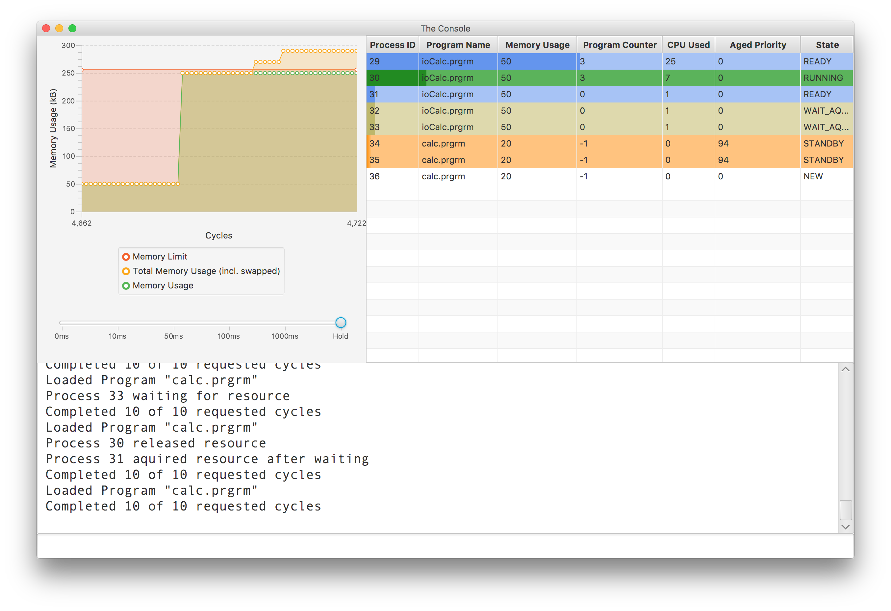
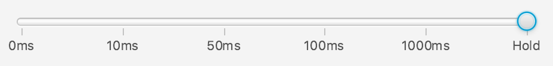

Summary
=====

The Operating System Simulator runs with a limitation of 256kB, and implements a priority/aging queue for the short-term and long-term scheduler.
The simulator simulates processes that compete for resources such as the CPU and I/O.  
"Programs" are first loaded by the simulator, and then the EXE command is used to execute the programs. 
If the amount of memory required by all loaded programs is greater than the limit, some programs will be swapped out of memory.  
The simulator features a terminal emulator with auto-complete, command history, and a limited implementation of 'cat' in java! 
The GUI also as visuals to help the user understand the current state of the simulator.

Usage
=====

The *Executable* directory contains the simulator as an executable jar,
and the *Program Files* subdirectory contains program and job files for
testing. All job and program files must be placed in the *Program Files*
directory to be used, and must have the file extensions *.prgrm* and
*.job*, respectively.

The command line interface will auto-suggest while you type. Suggestions
can be completed by pressing the Tab key. The previous command can be
repeated by pressing the Enter key. All previous commands can be
accessed with the Up arrow.

The *LOAD* command is used to load *jobs* and *programs*, allowing for
multiple inputs/parameters at a time, but is also used to list all
loadable files if no parameters are passed in.

The command-line interface implements most features of cat, which allows
for redirection into an output file. This means you can create and view
the contents of program and job files on-the-fly.

shortTermSchedulerTest.job
--------------------------

The following features can be observed when running
shortTermSchedulerTest.job.

-   The most CPU time is given to a High\_Priority\_CPU\_Bound\_Process.

-   IO utilization is indicated by a process being in the pink
    WAIT\_FOR\_IO state. Utilization is higher than would be expected
    based on priorities and aging alone. This is because a waiting
    process is given preference for the burst after the IO device
    is released. Frequently, a process can be observed in the
    WAIT\_FOR\_IO state with an aged priority of 1 or 0, which is lower
    than the high-priority process’ base priority of 2.

-   The Low\_Priority\_Background process receives the least CPU time,
    but does not undergo starvation.

longTermSchedulerTest.job
-------------------------

The following features can be observed when running
longTermSchedulerTest.job.

-   Memory usage never exceeds 256kb. Processes that are in the Orange
    STANDBY or White NEW states consume memory on the backing store, but
    not in main memory.

-   The long-term scheduler is executed at least once for every 20
    cycles of the short term scheduler. Execution of the
    long-term-scheduler can be observed when there is a change in which
    processes are in the Orange STANDBY state.

-   Processes that have not yet been executed are given an age based on
    the start-time of the system. Ensures that new processes have the
    highest priority, and are swapped into memory first.

Simulation Architecture
=======================

The simulator consists of three main packages. The *simulator* package
simulates hardware operation, including CPU execution and IO. The
*kernel* package contains the operating system which controls the
simulated hardware. The *user\_interface* package contains the shell and
GUI.

Compiler and Critical Sections
------------------------------

The Compiler in the *utilities* package reads program files and compiles
them into an array of Operation objects, which are machine code
instructions for our simulator. In addition to creating the appropriate
parameters for CALCULATE operations, the Compiler will also insert an
ACQUIRE operation before and a RELEASE operation after each IO
operation, creating a critical section in the code. When a process is
executing in its critical section, no other process will be able to
acquire the IO device in use.

Execution
---------

Because the CALCULATE operation consumes a variable number of cycles,
the CPU uses an Operation Counter as well as a Program Counter. The
Program Counter, as usual, indicates which operation is currently being
executed, and the Operation Counter indicates how many cycles are
remaining for that operation. Because kernel methods are executed on the
JVM and not on the simulated processor, kernel methods do not consume
CPU cycles. All operations on the simulated CPU can be considered to
execute in “user mode” and all methods from the *kernel* package can be
considered to execute in “kernel mode”. The only way to go from user
mode to kernel mode is to signal an interrupt.

Interrupts
----------

The hardware will blindly continue execution of the current process in
user mode until an interrupt flag is set in the interrupt processor. The
interrupt processor then routes the interrupt to the appropriate
handler. Most interrupt handlers will make use of a common
context-switch handler which copies CPU registers to the PCB for the
current process and copies saved register states from the next PCB to
the CPU. All interrupts are preemptive. The interrupt processor supports
two system-driven interrupts and four traps:

-   YIELD: Triggered by expiration of the burst timer set by the short
    term scheduler

-   IO\_COMPLETE: Signals that an IO event needs to be handled

-   TERMINATE: Terminates the current process

-   ACQUIRE: Requests access to a resource, blocking if the resource is
    not available, so that busy waiting is avoided

-   RELEASE: Releases a resource

-   WAIT\_FOR\_IO: Blocks until an IO\_COMPLETE signal is received

Scheduling
==========

The system uses a short-term scheduler and a long-term scheduler. The
short-term scheduler executes at the end of every CPU burst. The
long-term scheduler executes after 20 calls to the short-term scheduler,
or if the short-term scheduler is unable to select a process for
execution.

Short-term Scheduler
--------------------

The short-term scheduler schedules CPU bursts and IO for processes that
are in memory. It utilizes the following queues:

-   Ready Queue: There is one priority queue of processes waiting for
    CPU time.

-   Device Queues: There is one queue of processes waiting for accesses
    for each IO device. Currently, the simulation only uses one IO
    device, but it can accommodate more. When one process releases a
    device, the short-term scheduler immediately attempts to execute
    another process waiting for that device in order to maximize
    IO utilization.

-   Waiting Queue: There is one queue of processes waiting for a signal.
    Because IO response is the only signal in the simulator, there is no
    Event Queue. The running process will be preempted and the waiting
    process will be executed as soon as a signal is received.

Long-term Scheduler
-------------------

The long-term scheduler swaps processes in and out of memory, ensuring
that the memory limit is not exceeded. Each time the long-term scheduler
executes, it does the following:

-   Pulls all new processes off of the New Process Queue

-   If space is available in memory, processes from the Standby Queue
    are swapped into memory until there is no more space available.

-   If processes remain in Standby Queue, some processes are swapped out
    of memory to make room for processes that are standing by.

Scheduling Algorithm
--------------------

Both the long-term scheduler and short-term scheduler use
highest-priority first, with aging. Each program can be assigned a
priority in the second line of the program file, with the command
PRIORITY and an integer argument. Scheduling queues are implemented as
priority heaps. The effective priority of a process is its base priority
plus one fiftieth of its age. Age is defined as the time since the end
of the last CPU burst.

To maximize IO utilization, the RELEASE handler will immediately
schedule the next process waiting for the device, even if there are
higher priority processes in the waiting queue. This gives the IO-bound
process one “free” CPU burst, so that it can attempt to enter a state
where it is waiting for a response signal from the IO device.

GUI
===

{width="\textwidth"}

Overview
--------

The GUI features a live memory usage graph, process viewer, simulation
speed control slider, and a terminal emulator for the simulated
operating system.

Memory Graph
------------

The memory graph shows the system memory limit, the amount of memory
currently being used, and the amount of total memory (including swapped
out memory that isn’t being used, but is ready to be swapped in by
processes).

Delay Slider
------------

The slider changes the amount of delay between each CPU cycle. Moving
this all the way to the right will temporarily pause execution. If the
simulator is in the middle of an execution block, the block must be
completely run before any other commands must be input. Thus, the slider
may not be used to inject commands.

The slider can be used as a “step” button by quickly sliding from
*hold*, to *1000ms*, and back to *hold*.

Process Table
-------------

The process table shows a complete list of processes, and is sortable by
any column. Each row represents a process and is colored based on
process state. The background color for each row also serves as a
progress bar to hint at when the process will be finished executing.

Terminal Emulator
-----------------

The terminal emulator supports the following commands: “PROC”, “MEM”,
“LOAD”, “EXE”, “CAT”, “RESET”, and “EXIT”.

Auto-suggest supports all commands, including parameters (file names)
for LOAD and CAT. Auto-suggest even supports multiple parameters, and
will not suggest file names that have already been typed.

The terminal emulator supports the Enter key to repeat the last command,
the Tab key to auto-complete suggestions, and the up and down arrow keys
to browse command history.

If an typo is entered, the terminal emulator will try and figure out
your desired command, and display it for you to type correctly.

-   **PROC** is used to display info on all processes in plain-text.
    This is useful if you want to copy and paste process info, but is
    otherwise redundant (because of the process table)

-   **MEM** is used to display the amount of memory currently being
    used, as well as the amount of memory that is swapped out.

-   **LOAD**

    -   If no parameters are passed in, a list of loadable programs and
        jobs will be shown.

    -   One or more file names can be passed into be loaded by the
        simulator, in order of appearance. Job files are run on read,
        and are functionally equivalent to typing the contents of the
        job file into the terminal emulator.

-   **EXE** will run any program files that have been loaded. An integer
    can be passed in as a parameter to limit execution to a certain
    number of cycles. Otherwise, all loaded programs are run
    until termination.

-   **CAT** behaves very similarly to its bash counterpart. If run
    without any parameters, some help text will be output to
    the terminal.

-   **RESET** resets the simulator.

-   **EXIT** exits the program.
